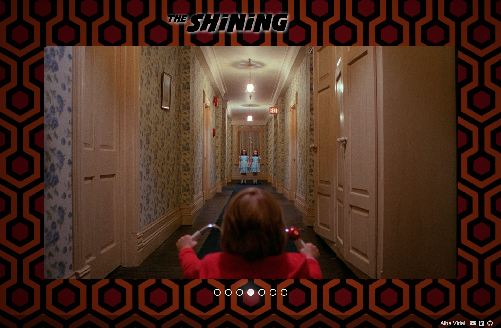

# THE SHINING

## Descripción

Esta web consiste en un carrusel de imágenes (slideshow) de la película The Shining de Stanley Kubrick.

La navegación es manual mediante botones y se puede ir a cualquier diapositiva usando los mismos.

La tipografía del título de la página es la misma usada en la película y está importada al estilo mediante @font-face.

Todo está hecho con HTML, CSS y JavaScript puro (vanilla js) sin librerías.

## Screenshots

## Sobre el código

Estoy trabajando en la mejora de esta app para implementar mejoras UI/UX y en la refactorización del código.

## Links

- [Code](https://github1s.com/albavidalm/The-Shining/ "Code")

- [Live](https://albavidalm.github.io/The-Shining/ "Live View")

## Commands

Puedes descargarte el código, instalarlo y arrancarlo en tu terminal.

## Built With

- JavaScript
- HTML
- CSS

## Autora

**Alba Vidal**

- [Profile](https://github.com/albavidalm "Alba Vidal")
- [Email](mailto:albavidalm@gmail.com?subject=Hi "Hi!")
- [Linkedin](https://www.linkedin.com/in/albavidalm/ "Let's work together!")

## 🖤 Support

Compartir es vivir, contributiones y sugerencias son siempre bienvenidas.
